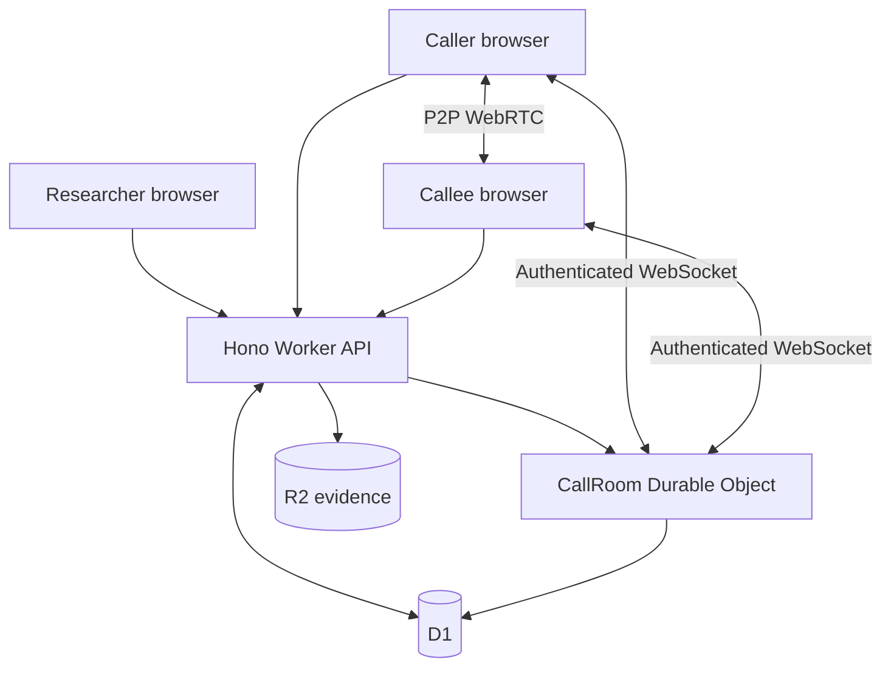

# ACE Omni

**Controlled communications experiments, runtime-independent conformance, and evidence.**

ACE Omni began as a Telecommunications Relay Services research laboratory. This repository resurrects that work and separates the enduring experiment model from any one implementation runtime.

Today Omni has four distinct layers:

```text
Experiment grammar          Omni Core
                                │
Execution runtimes     ┌────────┼────────┐
                       ▼        ▼        ▼
                  Cloudflare   SLEE    Elixip
                                │
Evidence                normalized observations
                                │
                                ▼
                         Omni evidence plane
```

The Cloudflare implementation remains the working browser/WebRTC research application. JAIN SLEE and Elixip are independent conformance runtimes used to test whether the same experiment semantics survive a change of substrate.

> **World creation belongs to attached systems. Experiment authority belongs to Omni.**

An execution endpoint may carry out commands and emit observations. It does not independently choose authoritative experiment identity, version, sequence, role, schedule, evidence identity, or verdict.

## What executes today

The Cloudflare reference runtime implements a secure human-in-the-loop communications research path with immutable experiment versions, pinned calls, single-use participant invitations, server-assigned identities and roles, per-call Durable Objects, WebRTC audio/video, deterministic caption/media conditions, authenticated schedules, MediaRecorder evidence, R2 checksum validation, D1 lifecycle events, immutable evidence manifests, replay/export, reconnect recovery, WebRTC `getStats()` telemetry, and generic Emulytics experiment-run adapters.

The repository also includes deterministic VRS video timing primitives for `video_lag`, `video_jitter`, and `video_freeze`.

## Omni Core

Porting ACE Omni across radically different runtimes exposed a smaller semantic kernel: **Omni Core**.

```text
ExperimentDefinition
        ↓
ExperimentVersion
        ↓
ExperimentRun
        ↓
Participants / Activities
        ↓
Commands ───────────────► external world
        ◄─────────────── Observations
        ↓
Transitions / Manipulations
        ↓
Evidence
        ↓
TerminalOutcome
```

The portable execution grammar is:

`events → bounded behavior → resource capabilities → observations → correlated state → evidence`

Commands and observations remain distinct:

- **Command** — an intended change to the world.
- **Observation** — what an execution runtime reports actually occurred.

Neither silently becomes the other.

### Runtime conformance

Canonical fixtures under `conformance/fixtures/` execute through independent implementations and produce normalized semantic traces. Runtime-specific implementation noise is excluded from equivalence.

The assertion is behavioral:

```text
semanticTrace(Cloudflare)
        ≡
semanticTrace(JAIN SLEE)
        ≡
semanticTrace(Elixip)
```

The current fixture set covers successful two-participant execution, duplicate-event idempotency, wrong-correlation isolation, transport-timeout failure, and duplicate-terminal isolation.

CI executes all five fixtures through the Cloudflare semantic model, the actual `OmniCallSbb`, and Elixip's real `SIP.Scenario` engine, then compares the normalized traces.

See [`docs/omni-core/`](docs/omni-core/) and [`conformance/`](conformance/).

## ElixiPG — Elixip Proving Grounds

**ElixiPG** is the controlled proving-ground layer for exercising communications behavior through [Elixip](https://github.com/neutrino38/elixip) and evaluating the result with Omni semantics and evidence.

ElixiPG is not a fork of Elixip and it is not a second SIP test framework.

```text
                     ElixiPG
              Elixip Proving Grounds

                     Trial
                       │
                       ▼
                Omni Core intent
                       │
                       ▼
                    Elixip
              SIP / media / FSM world
                       │
            events / observations
                       │
                       ▼
                Omni evidence plane
                       │
                       ▼
              validation / verdict
```

The authority boundary is explicit:

```text
Elixip makes communications happen.
Omni records and evaluates what happened.
ElixiPG defines the proving-ground trial.
```

A trial is never `proven` merely because its manifest says so. `npm run test:elixipg` verifies the evidence declared by each proven trial.

### PG-001 — Runtime Independence — `PROVEN`

PG-001 demonstrates that the same five canonical Omni fixtures produce equivalent semantic traces across Cloudflare Omni, JAIN SLEE Omni, and Elixip Omni.

```text
Cloudflare Omni
      ≡
JAIN SLEE Omni
      ≡
Elixip Omni
```

This is evidence that the surviving behavior belongs to the experiment grammar rather than to one implementation technology.

### PG-002 — SIP Establishment — `PROVEN`

PG-002 binds the abstract Omni `START_ACTIVITY` intent to Elixip's SIP transaction/dialog machinery and preserves the resulting execution as correlated evidence.

```text
START_ACTIVITY
      ↓
SIP INVITE serialized
      ↓
180 Ringing
      ↓
200 OK
      ↓
ACK
      ↓
dialog established
      ↓
media connectivity observed
      ↓
BYE serialized
      ↓
200 OK
      ↓
dialog terminated
      ↓
COMPLETED / pass
```

The trial deliberately uses Elixip's own `SIP.Test.Transport.UDPMockup` and `MediaServer.Mockup`. That exercises Elixip SIP serialization/parsing, transaction handling, dialog establishment, ACK/BYE behavior, SDP processing, and media-connectivity events while remaining deterministic in CI.

**Claim boundary:** PG-002 proves deterministic execution of Elixip's SIP/dialog/runtime semantics. It does **not** claim external-network SIP interoperability or RTP interoperability.

The natural next boundary is **PG-003 — External SIP Interoperability**: execute an Omni trial through Elixip across a real external SIP transport boundary, collect independent wire observations, and let Omni evaluate the resulting evidence.

See [`proving-grounds/`](proving-grounds/) and [`ports/elixip/`](ports/elixip/).

## Emulytics control and evidence plane

Omni raises the experiment-engine abstraction above a single telecommunications call without replacing the working call model.



```mermaid
flowchart LR
    experiment["Pinned experiment version"]
    run["ExperimentRun"]
    plan["Deterministic execution plan"]
    adapter["System-under-test adapter"]
    world["World / runtime under test"]
    observations["Versioned observations"]
    ledger["Omni evidence ledger"]
    analysis["Replay / comparison / analysis"]

    experiment --> run --> plan --> adapter --> world
    world --> observations --> ledger --> analysis
```

The generic engine provides immutable run identity, capability-scoped adapters, deterministic seedable command plans, canonical SHA-256 digests, stable sequencing, versioned observation envelopes, replay identity, conflict detection, and a synthetic loopback adapter.

The intended layering is:

`pinned experiment → experiment run → deterministic execution plan → adapters → world/system under test → observations → Omni evidence ledger`

See [Emulytics control plane](docs/EMULYTICS.md).

## Commanded conditions versus measured behavior

Omni distinguishes experimental intent from measured execution.

For example, commanded application-layer timing jitter is an experiment condition. Observed WebRTC jitter is a measurement from the actual RTP/ICE/media path.

The WebRTC telemetry observer normalizes RTP inter-arrival jitter, packet loss, jitter-buffer delay, remote jitter and RTT, selected ICE candidate-pair metrics, decoded/dropped frames, freezes, and audio concealment.

That enables the experimental chain:

`commanded condition → observed communications behavior → presentation degradation → participant effect`

See [VRS video timing](docs/VRS_VIDEO_TIMING.md) and [WebRTC telemetry](docs/WEBRTC_TELEMETRY.md).

## Why this is a research instrument

A recording by itself is only media. Omni preserves the chain connecting intended conditions to observed execution and resulting evidence.

For the browser call path:

`immutable experiment digest → pinned call → authenticated schedule → ordered acknowledgements and execution times → checksum-verified evidence → immutable manifest → pinned replay`

For generic attached systems:

`pinned experiment → deterministic run plan → capability-bound commands → versioned observations → replay-safe evidence identity → comparison and analysis`

Every browser or attached runtime is treated as an execution endpoint, not as experiment authority.

## Cloudflare reference runtime

The browser/WebRTC implementation uses React, Vite, Hono, Cloudflare Workers, D1, Durable Objects, R2, WebRTC, and AudioWorklets while preserving the original TRS research path.



Validated browser captures and the deeper implementation/security record live under [`docs/`](docs/).

## Repository map

- `apps/web` — React/Vite researcher and participant application.
- `apps/worker` — Hono API and the `CallRoom` Durable Object.
- `packages/domain` — shared versioned contracts.
- `packages/experiment-engine` — deterministic experiment-run, execution-plan, adapter, and observation protocols.
- `packages/media` — AudioWorklet graph, deterministic video timing, WebRTC telemetry, and evidence capture helpers.
- `packages/test-support` — two-context Playwright validation with fake media.
- `conformance` — canonical Omni Core fixtures, schemas, generated traces, and cross-runtime equivalence artifacts.
- `ports/jain-slee` — JAIN SLEE implementation of the Omni behavior boundary.
- `ports/elixip` — Elixip `SIP.Scenario` conformance adapter and ElixiPG scenarios.
- `proving-grounds` — ElixiPG trial registry and machine-enforced trial contracts.
- `docs/omni-core` — runtime-neutral semantic specification and lineage notes.
- `migrations` — ordered D1 migrations.

## Local setup

Requirements for the Cloudflare reference runtime: Node.js 22.14 or newer and npm.

```bash
npm ci
cp apps/worker/.dev.vars.example apps/worker/.dev.vars
npm run db:migrate:local
npm run seed:local
npm run build
npm run dev:worker
```

Open `http://127.0.0.1:8787`. For Vite hot reload, run `npm run dev` and open `http://127.0.0.1:5173`.

## Validation

Core Cloudflare validation:

```bash
npm run check:integrity
npm run tokens:check
npm run audit:dependencies
npm run typecheck
npm run build
npm test
npm run test:integration
npm run test:e2e
```

Omni Core and ElixiPG:

```bash
npm run test:conformance
npm run test:conformance:elixip
npm run test:elixipg
```

The complete GitHub Actions pipeline pins and compiles the JAIN SLEE and Elixip runtimes, executes the canonical conformance fixtures, performs cross-runtime semantic comparison, validates proven ElixiPG evidence, runs Worker/D1/R2/Durable Object integration tests, and finishes with the two-context Chromium/WebRTC vertical slice.

No production resources are created by these validation commands. `npm run build` performs a Worker deployment dry run only.

## Government notice and modification provenance

The original ACE Omni notice is preserved in [LICENSE](LICENSE), and the derivative-work record is separated in [NOTICE](NOTICE). The original notice states that the software/technical data was produced for the U.S. Government under Contract Number 75FCMC18D0047 and is subject to FAR 52.227-14.

- **Original material:** Approved for Public Release; Distribution Unlimited 24-0463.
- **Later modifications:** 2026, Robert McConnell ([@mcc0nnell](https://github.com/mcc0nnell)), as identified by this repository's Git history.

The 24-0463 identifier is reproduced only as part of the original notice. This repository does not represent it as review or public-release approval of the later modifications. This is not an official Federal Communications Commission publication, and no endorsement by the FCC or the U.S. Government is implied.

These provenance statements distinguish the modifications; they do not amend or relicense the original material.
