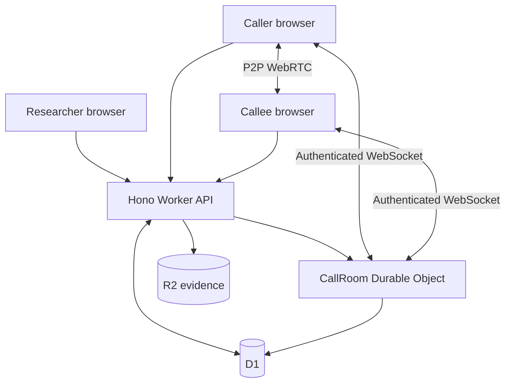

# ACE Omni

**Controlled experiments, runtime-independent execution semantics, and replayable evidence.**

ACE Omni began as a Telecommunications Relay Services research laboratory. This repository resurrects that work and separates the enduring experiment model from any one implementation runtime.

### Origin: MITRE's ACE Omni

**ACE Omni originates with The MITRE Corporation.** The original public repository, [`mitrefccace/ace-omni`](https://github.com/mitrefccace/ace-omni), describes ACE Omni as a TRS research platform for creating study experiences that emulate existing relay-service solutions or demonstrate novel ones, while managing experimental data and setup tools. Its stated goals included making TRS research faster and less expensive, producing defensible and repeatable results, and lowering barriers for researchers working on communications accessibility.

That original platform is the foundation of this repository. It was produced for the U.S. Government under Contract Number **75FCMC18D0047**, subject to **FAR 52.227-14, Rights in Data—General**, and released by MITRE as **Approved for Public Release; Distribution Unlimited 24-0463**. The original MITRE notice is preserved verbatim in [`LICENSE`](LICENSE).

The 2026 work is therefore not presented as a new project that merely happens to share the ACE Omni name. It is an explicit **resurrection and architectural continuation of MITRE's released research instrument**. The runtime has changed, the implementation has been substantially rebuilt, and the experiment model has been extracted and extended—but the project owes its starting point, its research purpose, and important parts of its experimental lineage to the MITRE team that built and released the original ACE Omni.

The Cloudflare application remains the working browser/WebRTC research instrument. But Omni is no longer best described as a Cloudflare app: the repository now contains a runtime-independent **Omni Core**, executable conformance ports for **JAIN SLEE** and **Elixip**, a machine-enforced proving-ground layer, and a generic experiment/evidence protocol for attached systems under test.

Elixip deserves particular credit in that evolution. **Elixip is designed and built by Emmanuel Buu / La Tribuu**, and its real SIP stack, scenario DSL, and explicit finite-state-machine execution model gave Omni an unusually clean independent communications runtime against which to test whether Omni Core was actually portable. ElixiPG is an ACE Omni layer, but the communications substrate beneath that proving ground is Emmanuel's work.

> **World creation and external effects belong to attached runtimes. Experiment authority belongs to Omni.**

An execution endpoint may carry out authorized commands and emit observations. It does not independently choose the authoritative experiment identity, version, sequence, role, schedule, evidence identity, or verdict.

```text
                     authoring / assessment intent
                               │
                               ▼
                         ┌───────────┐
                         │ Omni Core │
                         │ identity  │
                         │ commands  │
                         │ evidence  │
                         │ replay    │
                         └─────┬─────┘
                               │
                 ┌─────────────┼─────────────┐
                 ▼             ▼             ▼
            Cloudflare      JAIN SLEE      Elixip
           browser/DO       SBB / RA       SIP/FSM
                 │             │             │
                 └─────────────┼─────────────┘
                               ▼
                    normalized observations
                               │
                               ▼
                       Omni evidence plane
```

## Status at a glance

### On `main`

The repository currently contains:

- a secure Cloudflare-native human-in-the-loop communications research path with immutable experiment versions, pinned calls, signed invitations, synchronized conditions, WebRTC media, durable evidence, replay, and export;
- **Omni Core**, the runtime-neutral experiment grammar extracted from the original and Cloudflare implementations;
- canonical conformance fixtures whose normalized behavior is checked across **Cloudflare Omni, JAIN SLEE Omni, and Elixip Omni**;
- **ElixiPG**, a machine-enforced proving-ground registry;
- **PG-001 — Runtime Independence**, currently `proven` across all three runtimes;
- **PG-002 — SIP Establishment**, currently `planned` on `main`;
- a generic **Emulytics** experiment-run, adapter, observation, and evidence protocol;
- deterministic VRS video timing primitives and a WebRTC telemetry evidence path.

### Architecture in flight

Several open development branches extend that foundation. They are intentionally listed here as **in-flight work, not current `main` capabilities**:

- **Higher-order authoring:** SF26-style command expansion ([#19](https://github.com/mcc0nnell/ace-omni-cf/pull/19)) and a TalkPipe-inspired scenario compiler ([#20](https://github.com/mcc0nnell/ace-omni-cf/pull/20)).
- **Assurance / GRC:** deterministic OSCAL authorization-package graphs ([#22](https://github.com/mcc0nnell/ace-omni-cf/pull/22)), composable Regimes ([#23](https://github.com/mcc0nnell/ace-omni-cf/pull/23)), executable assessment packs ([#27](https://github.com/mcc0nnell/ace-omni-cf/pull/27)), OSCAL-native accessibility assurance ([#30](https://github.com/mcc0nnell/ace-omni-cf/pull/30)), and a candidate JAIN SLEE authorization profile ([#31](https://github.com/mcc0nnell/ace-omni-cf/pull/31)).
- **Experiment/world modeling:** FIREWHEEL-inspired Experiment IR ([#24](https://github.com/mcc0nnell/ace-omni-cf/pull/24)), Staghorn-style state branching ([#25](https://github.com/mcc0nnell/ace-omni-cf/pull/25)), and pinned SCEPTRE world bindings ([#28](https://github.com/mcc0nnell/ace-omni-cf/pull/28)).
- **Operator and assurance UI:** a spatial operating workspace ([#21](https://github.com/mcc0nnell/ace-omni-cf/pull/21)), governed operator/behavior contracts ([#26](https://github.com/mcc0nnell/ace-omni-cf/pull/26)), explorable assurance graphs ([#29](https://github.com/mcc0nnell/ace-omni-cf/pull/29)), and the Resilience Atlas rendering grammar ([#33](https://github.com/mcc0nnell/ace-omni-cf/pull/33)).
- **Bounded discovery:** discovery-under-uncertainty trials for the broader Omni Proving Grounds ([#32](https://github.com/mcc0nnell/ace-omni-cf/pull/32)).

The merge state of those PRs is authoritative. This section describes the direction of the architecture without collapsing draft work into shipped behavior.

## Architectural invariants

The implementations differ, but the core rules are deliberately stable:

1. **Experiment authority is separate from world execution.** Runtimes perform effects; Omni owns experiment identity, sequencing, evidence, and evaluation context.
2. **Commands are not observations.** A command expresses intended change. An observation records what a runtime reports actually happened.
3. **Higher-order behavior may not create a second effect path.** Authoring layers must ultimately lower into canonical commands and ordinary adapter/capability checks.
4. **Important state is pinned.** Experiment versions, run plans, schedules, and durable evidence are versioned, content-addressed, or cryptographically bound where appropriate.
5. **Replay must not rewrite history.** Later configuration changes cannot silently alter the identity or evidence of an earlier run.
6. **Presentation is not authority.** A dashboard, graph, operator pane, or hypothetical projection may explain state but must not silently become the source of authoritative experiment or compliance state.

## Omni Core

Porting ACE Omni across materially different runtimes exposed a smaller semantic kernel: **Omni Core**.

```text
ExperimentDefinition
        ↓
ExperimentVersion
        ↓
ExperimentRun
        ↓
Participants / Activities
        ↓
Commands ───────────────► external world
        ◄─────────────── Observations
        ↓
Transitions / Manipulations
        ↓
Evidence
        ↓
TerminalOutcome
```

The portable execution grammar is:

`events → bounded behavior → resource capabilities → observations → correlated state → evidence`

The runtime-neutral specification and lineage notes live under [`docs/omni-core/`](docs/omni-core/).

## Runtime conformance

Canonical fixtures under [`conformance/fixtures/`](conformance/fixtures/) execute through independent implementations and produce normalized semantic traces. Runtime-specific implementation noise is deliberately excluded from equivalence.

The current assertion is behavioral:

```text
semanticTrace(Cloudflare)
        ≡
semanticTrace(JAIN SLEE)
        ≡
semanticTrace(Elixip)
```

The fixture set covers:

- successful two-participant execution with an observation;
- duplicate-event idempotency;
- wrong run/activity correlation isolation;
- transport-timeout failure; and
- terminal-state isolation.

CI executes the same semantic contract through the Cloudflare model, the actual JAIN SLEE `OmniCallSbb`, and Elixip's `SIP.Scenario` engine, then compares the normalized traces.

The point is not that the runtimes are identical. The point is that the **experiment semantics survive the runtime change**.

## ElixiPG — Elixip Proving Grounds

**ElixiPG** is the first named proving-ground layer around Omni. It connects a controlled trial to an execution ground and requires machine-readable evidence before a trial can be called proven.

### Credit: Emmanuel Buu and Elixip

**Elixip is the work of Emmanuel Buu / La Tribuu.** ACE Omni did not invent Elixip's SIP stack, its telecom scenario DSL, its `SIP.Scenario` engine, or its finite-state-machine programming model. Those are Emmanuel's architecture and implementation.

That distinction matters because Elixip is not merely another library in this repository. Its design supplied the first external communications runtime that could exercise Omni semantics while keeping execution authority visibly separate from experiment authority. Elixip scenarios are ordinary `.exs` programs expressed through an explicit `state` / `on_events` / `goto` model, running over a native Elixir SIP stack with access to dialog, transaction, and event-message behavior. That is exactly the kind of concrete, asynchronous telecommunications machinery against which a supposedly runtime-independent experiment grammar should have to prove itself.

In practical terms, **ElixiPG exists in its current form because Emmanuel built a framework with a clean enough boundary to make this experiment possible**. Omni contributes the trial identity, conformance fixtures, evidence normalization, validation, and verdict discipline. Elixip contributes the independent communications world in which those claims can be tested rather than merely asserted.

The adapter and Omni scenarios in this repository are ACE Omni work; the Elixip engine beneath them is Emmanuel's. The separation is both architectural and legal, and the project is stronger for it. **Thank you, Emmanuel.**

```text
Trial
  ↓
Omni Core intent
  ↓
execution ground
  ↓
events / observations
  ↓
Omni evidence plane
  ↓
validation / verdict
```

The authority boundary is explicit:

```text
Elixip makes communications behavior happen.
Omni records and evaluates what happened.
ElixiPG defines the controlled trial.
```

A manifest cannot make itself `proven`. `npm run test:elixipg` validates the trial registry and verifies the declared evidence for proven trials.

### PG-001 — Runtime Independence — `PROVEN`

PG-001 demonstrates that the same five canonical Omni fixtures produce equivalent semantic traces across Cloudflare Omni, JAIN SLEE Omni, and Elixip Omni.

```text
Cloudflare Omni
      ≡
JAIN SLEE Omni
      ≡
Elixip Omni
```

This is evidence that the surviving behavior belongs to the experiment grammar rather than to one implementation technology.

### PG-002 — SIP Establishment — `PLANNED`

PG-002 is the next communications proving-ground boundary on `main`:

`START_ACTIVITY → SIP INVITE → provisional response → dialog established → media observed → dialog terminated → terminal verdict`

It must not become `proven` until a real Elixip SIP scenario emits normalized Omni evidence and satisfies the trial's declared assertions.

See [`proving-grounds/`](proving-grounds/) and [`ports/elixip/`](ports/elixip/).

## Cloudflare reference runtime

The browser/WebRTC implementation remains the most complete end-to-end Omni runtime. It uses React, Vite, Hono, Cloudflare Workers, D1, Durable Objects, R2, WebRTC, and AudioWorklets.

The implemented vertical slice includes:

- server-managed researcher login, HttpOnly session cookies, and double-submit CSRF protection;
- owned experiments with immutable SHA-256-addressed versions;
- calls pinned to exact experiment-version snapshots;
- call-bound, expiring, cryptographically signed, single-use invitations;
- server-assigned participant identity and role;
- short-lived one-use credentials for per-call Durable Object WebSockets;
- target-authorized WebRTC signaling and isolated P2P audio/video;
- synthetic mock captions for deterministic testing;
- a Durable Object call clock and experiment-derived HMAC-signed schedule;
- AudioWorklet frame scheduling, caption conditions, acknowledgements, and observed execution times;
- MediaRecorder evidence, one-use upload authorization, R2 checksum validation, and D1 lifecycle events;
- versioned immutable evidence manifests, authorized downloads, research export, and pinned replay;
- reconnect recovery, authoritative resynchronization, and a persistent idempotent client outbox; and
- semantic accessibility tokens for caption sizing, high contrast, attribution, focus, and related presentation requirements.



Validated browser captures and the deeper implementation/security record live under [`docs/`](docs/).

## Emulytics control and evidence plane

Omni also raises the experiment-engine abstraction above a single telecommunications call without replacing the working call model.

```mermaid
flowchart LR
    experiment["Pinned experiment version"]
    run["ExperimentRun"]
    plan["Deterministic execution plan"]
    adapter["System-under-test adapter"]
    world["World / runtime under test"]
    observations["Versioned observations"]
    ledger["Omni evidence ledger"]
    analysis["Replay / comparison / analysis"]

    experiment --> run --> plan --> adapter --> world
    world --> observations --> ledger --> analysis
```



The generic engine provides immutable run identity, capability-scoped adapters, deterministic seedable command plans, canonical SHA-256 digests, stable sequencing, versioned observation envelopes, replay identity, conflict detection, and a synthetic loopback adapter.

The intended layering is:

`pinned experiment → experiment run → deterministic execution plan → adapters → world/system under test → observations → Omni evidence ledger`

See [`docs/EMULYTICS.md`](docs/EMULYTICS.md).

## Commanded conditions versus measured behavior

Omni distinguishes experimental intent from measured execution.

For example, commanded application-layer timing jitter is an experiment condition. Observed WebRTC jitter is a measurement from the actual RTP/ICE/media path.

The repository includes:

- deterministic application-layer `video_lag`, `video_jitter`, and `video_freeze` timing primitives; and
- a WebRTC `getStats()` evidence path for RTP jitter, jitter-buffer delay, packet loss, RTT, selected ICE candidate-pair metrics, decoded/dropped frames, freezes, and audio concealment.

That supports the experimental chain:

`commanded condition → observed communications behavior → presentation degradation → participant effect`

The VRS timing primitives are implemented and tested but are not yet wired into the current `CallPage` rendering path.

See [`docs/VRS_VIDEO_TIMING.md`](docs/VRS_VIDEO_TIMING.md) and [`docs/WEBRTC_TELEMETRY.md`](docs/WEBRTC_TELEMETRY.md).

## Why this is a research instrument

A recording by itself is only media. Omni preserves the chain connecting intended conditions to observed execution and resulting evidence.

For the browser call path:

`immutable experiment digest → pinned call → authenticated schedule → ordered acknowledgements and execution times → checksum-verified evidence → immutable manifest → pinned replay`

For attached systems:

`pinned experiment → deterministic run plan → capability-bound commands → versioned observations → replay-safe evidence identity → comparison and analysis`

That distinction is what makes Omni useful for controlled communications research today and what allows the same architecture to grow toward security testing, assurance, and GRC without turning a model, UI, or external runtime into experiment authority.

## Repository map

- `apps/web` — React/Vite researcher and participant application.
- `apps/worker` — Hono API and the `CallRoom` Durable Object.
- `packages/domain` — shared versioned contracts.
- `packages/experiment-engine` — deterministic experiment-run, execution-plan, adapter, and observation protocols.
- `packages/media` — AudioWorklet graph, deterministic video timing, WebRTC telemetry, and evidence capture helpers.
- `packages/test-support` — two-context Playwright validation with synthetic media.
- `conformance` — canonical Omni Core fixtures, schemas, generated traces, and cross-runtime equivalence artifacts.
- `ports/jain-slee` — JAIN SLEE implementation of the Omni behavior boundary.
- `ports/elixip` — ACE Omni's adapter to Emmanuel Buu's Elixip `SIP.Scenario` engine and the ElixiPG proving-ground integration.
- `proving-grounds` — ElixiPG trial registry and machine-enforced trial contracts.
- `docs/omni-core` — runtime-neutral semantic specification and lineage notes.
- `migrations` — ordered D1 migrations.

## Local setup

Requirements for the Cloudflare reference runtime: Node.js 22.14 or newer and npm.

```bash
npm ci
cp apps/worker/.dev.vars.example apps/worker/.dev.vars
npm run db:migrate:local
npm run seed:local
npm run build
npm run dev:worker
```

Open `http://127.0.0.1:8787`. For Vite hot reload, run `npm run dev:web` and open `http://127.0.0.1:5173`.

## Validation

Cloudflare/reference-runtime gates:

```bash
npm run check:integrity
npm run tokens:check
npm run audit:dependencies
npm run typecheck
npm run build
npm test
npm run test:integration
npm run test:e2e
```

Omni Core and proving-ground gates:

```bash
npm run test:conformance
npm run test:conformance:elixip
npm run test:elixipg
```

The complete GitHub Actions pipeline also compiles the JAIN SLEE and pinned Elixip runtimes, executes the canonical conformance fixtures, performs cross-runtime semantic comparison, validates proven proving-ground evidence, runs Worker/D1/R2/Durable Object integration tests, and finishes with the two-context Chromium/WebRTC vertical slice.

No production resources are created by these validation commands. `npm run build` performs a Worker deployment dry run only.

## Elixip attribution and license boundary

Elixip is an external project by **Emmanuel Buu / La Tribuu** and is distributed under the **Business Source License 1.1 (BSL 1.1)**. ACE Omni does not vendor Elixip implementation source. CI pins an external Elixip checkout so proving-ground results cannot silently move with upstream changes.

The Elixip license includes an Additional Use Grant and separately states that `.exs` scenarios executed by the Elixip scenario engine are not considered derivative works of Elixip. That boundary is important here: ACE Omni owns its ElixiPG scenarios and evidence machinery; Emmanuel retains authorship and licensing authority over Elixip itself.

See [`LICENSE`](LICENSE), [`NOTICE`](NOTICE), and [`ports/elixip/README.md`](ports/elixip/README.md) for the repository's recorded provenance and the precise integration boundary. The upstream Elixip license remains controlling for use of Elixip.

## MITRE / FCC origin and modification provenance

The original ACE Omni notice is preserved **verbatim** in [`LICENSE`](LICENSE), and the derivative-work record is separated in [`NOTICE`](NOTICE). That arrangement is deliberate: `LICENSE` records the legal notice attached to the MITRE-origin material; `NOTICE` explains the later repository lineage without pretending to rewrite MITRE's terms.

The provenance chain is:

- **MITRE original:** The MITRE Corporation designed and implemented the original ACE Omni TRS research platform and published it from the `mitrefccace` organization. Its README defined the core research mission around configurable TRS experiments, repeatable data, defensible conclusions, and lower barriers to accessibility research.
- **Government contract and release:** The original software/technical data was produced for the U.S. Government under Contract Number **75FCMC18D0047**, subject to **FAR 52.227-14**, with MITRE's 2024 copyright notice. The release carries **Approved for Public Release; Distribution Unlimited 24-0463**.
- **2026 resurrection and extension:** Robert McConnell ([@mcc0nnell](https://github.com/mcc0nnell)) rebuilt the working platform around Cloudflare infrastructure, extracted Omni Core, added independent runtime ports, conformance testing, proving grounds, and the broader experiment/evidence architecture. Git history is the authoritative record of those later changes.
- **Independent runtime contribution:** Emmanuel Buu / La Tribuu independently created Elixip. ACE Omni later integrated Elixip as an external proving runtime; that integration does not make Elixip MITRE work or make Emmanuel an author of ACE Omni.

The distinction matters in both directions. **The 2026 project does not claim MITRE's original work as newly authored work, and MITRE is not represented as having authored, reviewed, approved, or endorsed the later modifications.** Likewise, the FCC and U.S. Government are not represented as having reviewed or approved the revived system.

The identifier **24-0463** is reproduced only as provenance for the original MITRE release. It is not represented as a new public-release determination, copyright permission, or authorization for the later modifications.

ACE Omni exists today because MITRE built and publicly released the original research instrument. The current repository deliberately preserves that lineage while making the boundaries around later engineering visible.