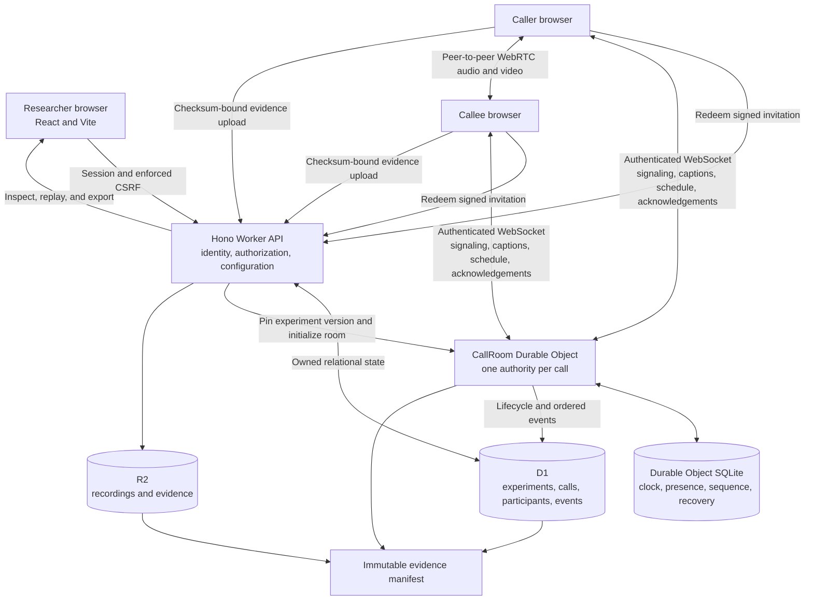
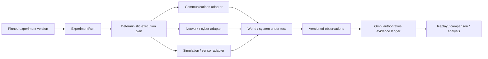
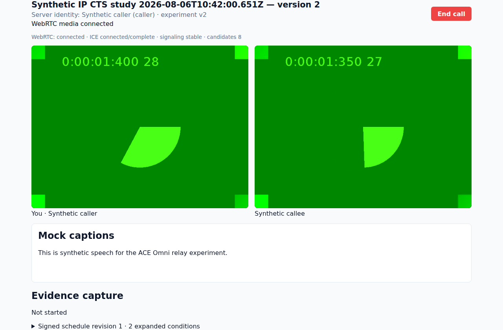
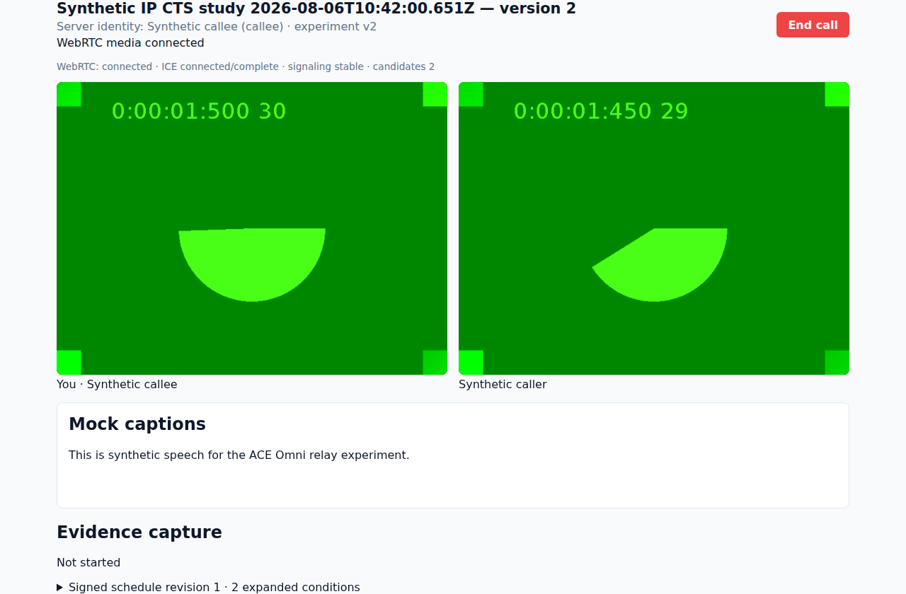
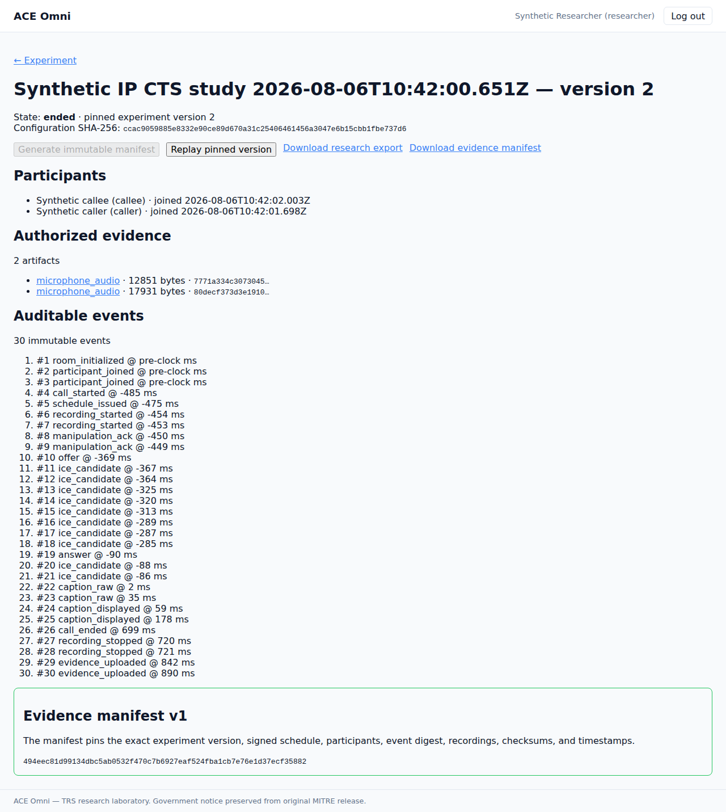

# ACE Omni (Cloudflare-native)

ACE Omni is a controlled Telecommunications Relay Services research laboratory and an emerging experiment-control and evidence plane for human-in-the-loop communications research. It is not a generic video-chat application and it is not a simulator. Researchers save immutable communications conditions, issue call-bound participant invitations, run synchronized calls, apply deterministic conditions, collect checksum-linked evidence, and can now compile generic experiment runs for attached systems under test.

This repository resurrects the original [ACE Omni](https://github.com/mitrefccace/ace-omni) architecture on React, Vite, Hono, Cloudflare Workers, D1, Durable Objects, R2, WebRTC, and AudioWorklets while preserving the existing TRS call path.

## What executes today

The implemented vertical slice covers:

1. Server-managed researcher login, HttpOnly session cookie, and enforced double-submit CSRF token.
2. Owned experiments with immutable, SHA-256-addressed versions.
3. Calls pinned to an exact experiment-version snapshot.
4. Call-bound, expiring, cryptographically signed, single-use invitations.
5. Server-assigned participant identity and role.
6. A short-lived, one-use credential for the per-call Durable Object WebSocket.
7. Target-authorized WebRTC signaling and isolated P2P audio/video.
8. Credential-free synthetic mock captions.
9. A Durable Object call clock and an experiment-derived HMAC-signed schedule.
10. AudioWorklet frame scheduling plus caption conditions, acknowledgements, and observed execution times.
11. Configured MediaRecorder evidence, one-use upload authorization, R2 checksum validation, and D1 lifecycle events.
12. A versioned immutable evidence manifest, authorized downloads, research export, and pinned replay.
13. Fresh-credential reconnect, authoritative resynchronization, and a persistent client outbox for idempotent research observations.
14. An unbranded semantic-token system that enforces contrast and renders the pinned caption size, high-contrast, and attribution settings.

Alongside that live call path, the repository now includes three additional research primitives:

- **Generic Emulytics protocol:** first-class `ExperimentRun`, deterministic execution plans, capability-scoped system-under-test adapters, canonical plan digests, versioned observation envelopes, replay identity, and a synthetic loopback adapter.
- **Deterministic VRS video timing primitives:** application-layer `video_lag`, `video_jitter`, and `video_freeze` conditions with seeded frame decisions. These primitives are implemented and tested but are not yet wired into the current `CallPage` rendering path.
- **WebRTC telemetry observer:** real `RTCPeerConnection.getStats()` measurement for RTP jitter, jitter-buffer delay, packet loss, RTT, frame drops, freezes, audio concealment, and selected ICE candidate-pair metrics. The observer is implemented and tested; generic observation-to-ledger runtime wiring is the next integration step.

## How Omni works

The browsers execute media and scheduled conditions, but the server decides the authoritative identity, configuration, timing, and evidence metadata.



1. The researcher signs in through a server-managed session. D1 stores only the session-token hash; state-changing requests require the matching CSRF token and an allowed origin.
2. The Worker validates an experiment with the shared Zod schema and saves an immutable version plus its SHA-256 digest. Every call pins one exact version.
3. The Worker issues call-, version-, role-, and expiration-bound invitations. Atomic redemption assigns identity and role on the server and prevents reuse.
4. Each participant receives a short-lived, one-use credential for that call's Durable Object. The room revalidates it before accepting the WebSocket, and every reconnect obtains a new credential before accepting an authoritative state snapshot.
5. The Durable Object establishes the authoritative clock, persists room state, expands the pinned experiment into an HMAC-authenticated schedule, authorizes signaling, and records ordered events. Evidence-bearing client observations use stable client event IDs, so a lost acknowledgement can be replayed without creating a second event. WebRTC media flows directly between the browsers.
6. Caption conditions and AudioWorklets execute at schedule-derived offsets. Clients acknowledge assigned conditions and report observed execution times without controlling the authoritative schedule.
7. MediaRecorder captures only policy-authorized streams. The Worker binds each one-use upload to its call, participant, artifact type, size, and SHA-256 digest before storing bytes in R2 and metadata in D1.
8. Finalization produces an immutable manifest connecting the pinned configuration, participants, schedule, events, captions, recordings, checksums, and timestamps. The researcher can inspect, download, export, or replay that exact version.

## Emulytics control and evidence plane

Omni now raises the experiment-engine abstraction above a single telecommunications call without replacing the working call model.



**World creation belongs to attached systems. Experiment authority belongs to Omni.**

The generic engine provides:

- immutable run identity tied to a pinned experiment version;
- capability-scoped `SystemUnderTestAdapter` contracts;
- deterministic, seedable command plans with canonical SHA-256 digests;
- stable command sequencing independent of input ordering;
- versioned observation envelopes with source identity and payload digests;
- idempotent replay identity and conflict detection; and
- a synthetic loopback adapter for validating the protocol without coupling Omni to a simulator.

The intended layering is:

`pinned experiment → experiment run → deterministic execution plan → adapters → world/system under test → observations → Omni evidence ledger`

A future minimega, SCEPTRE, Firewheel, Unreal, hardware-in-the-loop, network-emulation, sensor, or other integration should implement this adapter boundary rather than introduce a parallel experiment model.

See [Emulytics control plane](docs/EMULYTICS.md).

## Jitter: commanded conditions versus measured behavior

Omni deliberately distinguishes two different signals that are often both called “jitter.”

**Commanded application-layer timing jitter** is an experiment condition. The VRS timing primitives can deterministically vary presentation timing with seeded `video_lag`, `video_jitter`, and `video_freeze` behavior.

**Observed WebRTC jitter** is a measurement from the actual RTP/ICE/media path. The WebRTC telemetry observer samples `RTCPeerConnection.getStats()` and normalizes browser metrics including:

- RTP inter-arrival jitter;
- cumulative and interval packet loss;
- jitter-buffer cumulative, average, target, and minimum delay;
- remote-reported jitter and RTT;
- selected ICE candidate-pair RTT and available bitrate;
- decoded/dropped frames and freeze counts/duration; and
- concealed audio samples and concealment events.

This separation enables a real experimental chain without assuming equivalence:

`commanded timing condition → observed RTP/media behavior → presentation degradation → participant effect`

The observer preserves both local observation time and source `RTCStats.timestamp`, stable peer-connection source identity, and monotonically increasing sample sequence. It intentionally does not impose a universal jitter pass/fail threshold.

See [VRS video timing](docs/VRS_VIDEO_TIMING.md) and [WebRTC telemetry and jitter detection](docs/WEBRTC_TELEMETRY.md).

## Why this is a research instrument

A recording by itself is only media. Omni produces a defensible research record by preserving the complete chain from intended conditions to observed execution:

`immutable experiment digest → pinned call → HMAC-authenticated schedule → ordered acknowledgements and execution times → checksum-verified evidence → immutable manifest → pinned replay`

The generic Emulytics path extends the same principle:

`pinned experiment → deterministic run plan → capability-bound commands → versioned observations → replay-safe evidence identity → comparison and analysis`

That chain lets a researcher establish which configuration governed the call or run, who or what occupied each role, what each execution endpoint was instructed to do, what it reported or measured, which artifacts were collected, whether their bytes still match, and which exact configuration a replay uses. A later experiment version cannot silently rewrite an earlier result.

Omni also treats every browser or attached runtime as an untrusted execution endpoint. An endpoint may capture media, apply assigned conditions, execute adapter commands, and report observations, but it cannot choose its authoritative identity, role, room, experiment version, schedule or plan sequence, evidence object key, or evidence metadata.

- **Researcher boundary:** opaque server-managed sessions, HttpOnly cookies, SameSite enforcement, exact credentialed origins, Fetch Metadata checks, double-submit CSRF, and ownership checks.
- **Participant boundary:** call-, version-, role-, and expiration-bound invitations; atomic single redemption; server-assigned identity; and short-lived, one-use room credentials revalidated by the Durable Object.
- **Room boundary:** same-call signaling targets, authoritative timing, authenticated schedules, assigned-manipulation acknowledgements, ordered events, and persisted hibernation recovery.
- **Experiment boundary:** pinned run identity, capability-declared adapters, deterministic command sequencing, canonical plan digests, and replay-safe observation identity.
- **Evidence boundary:** owned downloads plus one-use uploads bound to call, participant, artifact type, content type, size, checksum, and a server-selected R2 key.

## Validated browser views

These captures come from the passing two-context Playwright call using synthetic identities, mock captions, and Chromium fake camera and microphone devices. The green frames are the fake camera feed, not real participant media.

| Caller | Callee |
| --- | --- |
|  |  |

The researcher view connects the pinned experiment version to participants, authorized recordings, ordered events, checksums, replay, export, and the immutable evidence manifest.



See [architecture audit](docs/ARCHITECTURE_AUDIT.md), [implementation status](docs/IMPLEMENTATION_STATUS.md), [security boundaries](docs/SECURITY.md), [Emulytics control plane](docs/EMULYTICS.md), [VRS video timing](docs/VRS_VIDEO_TIMING.md), [WebRTC telemetry](docs/WEBRTC_TELEMETRY.md), and the [executed validation record](docs/VALIDATION.md).

## Repository map

- `apps/web` — React/Vite researcher and participant application.
- `apps/worker` — Hono API and the `CallRoom` Durable Object.
- `packages/domain` — shared versioned Zod contracts.
- `packages/experiment-engine` — deterministic TRS schedule expansion plus generic experiment-run, execution-plan, adapter, and observation protocols.
- `packages/media` — AudioWorklet graph and frame mapping, deterministic video timing primitives, seeded randomness, WebRTC telemetry normalization/observation, and MediaRecorder helpers.
- `packages/test-support` — two-independent-context Playwright test with fake media.
- `migrations` — ordered D1 migrations.

## Clean local setup

Requirements: Node.js 22.14 or newer and npm.

```bash
npm ci
cp apps/worker/.dev.vars.example apps/worker/.dev.vars
npm run db:migrate:local
npm run seed:local
npm run build
npm run dev:worker
```

Open `http://127.0.0.1:8787`. The local-only synthetic seed account is `researcher@omni.local`; its default password is `local-only-synthetic-password`. Override it with `OMNI_SEED_PASSWORD`. The seed script refuses `--remote` and production execution, and it is not part of the Worker bundle.

For Vite hot reload, run `npm run dev` and open `http://127.0.0.1:5173`.

## Validation

```bash
npm run check:integrity
npm run tokens:check
npm run audit:dependencies
npm run typecheck
npm run build
npm test
npm run test:integration
npm run test:e2e
```

`npm run test:e2e` resets an isolated local Cloudflare state directory, builds the web app, applies all migrations, seeds synthetic data, starts Wrangler, and runs Chromium with fake camera and microphone devices. It creates two independent browser contexts and preserves screenshots/traces in the Playwright artifacts.

No production resources are created by these commands. `npm run build` performs a Worker deployment dry run only.

## Government notice and modification provenance

The original ACE Omni notice is preserved in [LICENSE](LICENSE), and the derivative-work record is separated in [NOTICE](NOTICE). The original notice states that the software/technical data was produced for the U.S. Government under Contract Number 75FCMC18D0047 and is subject to FAR 52.227-14.

- **Original material:** Approved for Public Release; Distribution Unlimited 24-0463.
- **Cloudflare-native modifications:** 2026, Robert McConnell ([@mcc0nnell](https://github.com/mcc0nnell)), as identified by this repository's Git history.

The 24-0463 identifier is reproduced only as part of the original notice. This repository does not represent it as review or public-release approval of the later Cloudflare-native modifications. This is not an official Federal Communications Commission publication, and no endorsement by the FCC or the U.S. Government is implied.

These provenance statements distinguish the modifications; they do not amend or relicense the original material.
