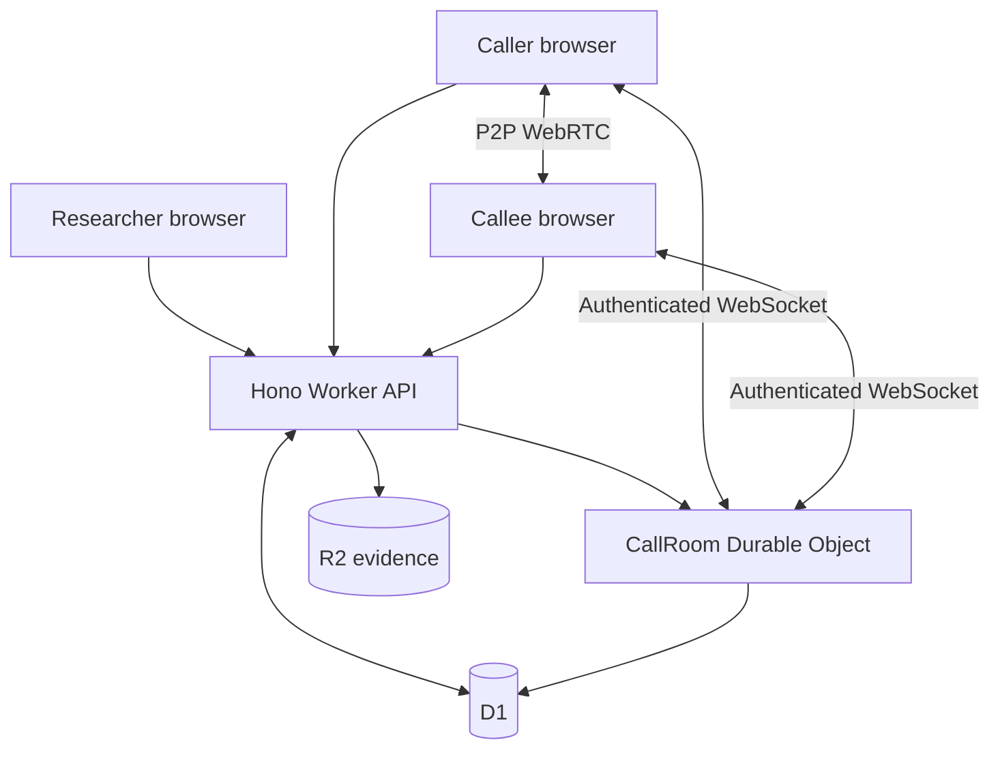

# ACE Omni

**Controlled experiments, runtime-independent execution semantics, and replayable evidence.**

ACE Omni began as a Telecommunications Relay Services research laboratory. This repository resurrects that work and separates the enduring experiment model from any one implementation runtime.

The Cloudflare application remains the working browser/WebRTC research instrument. But Omni is no longer best described as a Cloudflare app: the repository now contains a runtime-independent **Omni Core**, executable conformance ports for **JAIN SLEE** and **Elixip**, a machine-enforced proving-ground layer, and a generic experiment/evidence protocol for attached systems under test.

> **World creation and external effects belong to attached runtimes. Experiment authority belongs to Omni.**

An execution endpoint may carry out authorized commands and emit observations. It does not independently choose the authoritative experiment identity, version, sequence, role, schedule, evidence identity, or verdict.

```text
                     authoring / assessment intent
                               │
                               ▼
                         ┌───────────┐
                         │ Omni Core │
                         │ identity  │
                         │ commands  │
                         │ evidence  │
                         │ replay    │
                         └─────┬─────┘
                               │
                 ┌─────────────┼─────────────┐
                 ▼             ▼             ▼
            Cloudflare      JAIN SLEE      Elixip
           browser/DO       SBB / RA       SIP/FSM
                 │             │             │
                 └─────────────┼─────────────┘
                               ▼
                    normalized observations
                               │
                               ▼
                       Omni evidence plane
```

## Status at a glance

### On `main`

The repository currently contains:

- a secure Cloudflare-native human-in-the-loop communications research path with immutable experiment versions, pinned calls, signed invitations, synchronized conditions, WebRTC media, durable evidence, replay, and export;
- **Omni Core**, the runtime-neutral experiment grammar extracted from the original and Cloudflare implementations;
- canonical conformance fixtures whose normalized behavior is checked across **Cloudflare Omni, JAIN SLEE Omni, and Elixip Omni**;
- the **Omni Proving Grounds**, a machine-enforced trial registry supporting `conformance` and `discovery` modes, with ElixiPG as its first named ground;
- **PG-001 — Runtime Independence**, currently `proven` across all three runtimes;
- **PG-002 — SIP Establishment**, currently `planned` on `main`;
- **PG-003 — Discovery Under Uncertainty**, currently `proven` as the first bounded-discovery trial;
- a generic **Emulytics** experiment-run, adapter, observation, and evidence protocol;
- deterministic VRS video timing primitives and a WebRTC telemetry evidence path.

### Architecture in flight

Several open development branches extend that foundation. They are intentionally listed here as **in-flight work, not current `main` capabilities**:

- **Higher-order authoring:** SF26-style command expansion ([#19](https://github.com/mcc0nnell/ace-omni-cf/pull/19)) and a TalkPipe-inspired scenario compiler ([#20](https://github.com/mcc0nnell/ace-omni-cf/pull/20)).
- **Assurance / GRC:** deterministic OSCAL authorization-package graphs ([#22](https://github.com/mcc0nnell/ace-omni-cf/pull/22)), composable Regimes ([#23](https://github.com/mcc0nnell/ace-omni-cf/pull/23)), executable assessment packs ([#27](https://github.com/mcc0nnell/ace-omni-cf/pull/27)), OSCAL-native accessibility assurance ([#30](https://github.com/mcc0nnell/ace-omni-cf/pull/30)), and a candidate JAIN SLEE authorization profile ([#31](https://github.com/mcc0nnell/ace-omni-cf/pull/31)).
- **Experiment/world modeling:** FIREWHEEL-inspired Experiment IR ([#24](https://github.com/mcc0nnell/ace-omni-cf/pull/24)), Staghorn-style state branching ([#25](https://github.com/mcc0nnell/ace-omni-cf/pull/25)), and pinned SCEPTRE world bindings ([#28](https://github.com/mcc0nnell/ace-omni-cf/pull/28)).
- **Operator and assurance UI:** a spatial operating workspace ([#21](https://github.com/mcc0nnell/ace-omni-cf/pull/21)), governed operator/behavior contracts ([#26](https://github.com/mcc0nnell/ace-omni-cf/pull/26)), explorable assurance graphs ([#29](https://github.com/mcc0nnell/ace-omni-cf/pull/29)), and the Resilience Atlas rendering grammar ([#33](https://github.com/mcc0nnell/ace-omni-cf/pull/33)).

The merge state of those PRs is authoritative. This section describes the direction of the architecture without collapsing draft work into shipped behavior.

## Architectural invariants

The implementations differ, but the core rules are deliberately stable:

1. **Experiment authority is separate from world execution.** Runtimes perform effects; Omni owns experiment identity, sequencing, evidence, and evaluation context.
2. **Commands are not observations.** A command expresses intended change. An observation records what a runtime reports actually happened.
3. **Higher-order behavior may not create a second effect path.** Authoring layers must ultimately lower into canonical commands and ordinary adapter/capability checks.
4. **Important state is pinned.** Experiment versions, run plans, schedules, and durable evidence are versioned, content-addressed, or cryptographically bound where appropriate.
5. **Replay must not rewrite history.** Later configuration changes cannot silently alter the identity or evidence of an earlier run.
6. **Presentation is not authority.** A dashboard, graph, operator pane, or hypothetical projection may explain state but must not silently become the source of authoritative experiment or compliance state.

## Omni Core

Porting ACE Omni across materially different runtimes exposed a smaller semantic kernel: **Omni Core**.

```text
ExperimentDefinition
        ↓
ExperimentVersion
        ↓
ExperimentRun
        ↓
Participants / Activities
        ↓
Commands ───────────────► external world
        ◄─────────────── Observations
        ↓
Transitions / Manipulations
        ↓
Evidence
        ↓
TerminalOutcome
```

The portable execution grammar is:

`events → bounded behavior → resource capabilities → observations → correlated state → evidence`

The runtime-neutral specification and lineage notes live under [`docs/omni-core/`](docs/omni-core/).

## Runtime conformance

Canonical fixtures under [`conformance/fixtures/`](conformance/fixtures/) execute through independent implementations and produce normalized semantic traces. Runtime-specific implementation noise is deliberately excluded from equivalence.

The current assertion is behavioral:

```text
semanticTrace(Cloudflare)
        ≡
semanticTrace(JAIN SLEE)
        ≡
semanticTrace(Elixip)
```

The fixture set covers:

- successful two-participant execution with an observation;
- duplicate-event idempotency;
- wrong run/activity correlation isolation;
- transport-timeout failure; and
- terminal-state isolation.

CI executes the same semantic contract through the Cloudflare model, the actual JAIN SLEE `OmniCallSbb`, and Elixip's `SIP.Scenario` engine, then compares the normalized traces.

The point is not that the runtimes are identical. The point is that the **experiment semantics survive the runtime change**.

## Omni Proving Grounds

The **Omni Proving Grounds** connect a controlled trial to an execution ground and require machine-readable evidence before a trial can be called proven. **ElixiPG** is the first named ground; the trial contract itself is not Elixip-specific.

```text
Trial
  ↓
Omni Core intent
  ↓
execution ground
  ↓
events / observations
  ↓
Omni evidence plane
  ↓
validation / verdict
```

The authority boundary is explicit:

```text
The ground makes behavior happen.
Omni controls experiment identity and evidence.
The trial constrains what may be tested.
The agent may choose among authorized experiments.
The verdict is independent of the agent.
```

A manifest cannot make itself `proven`. `npm run test:elixipg` validates the trial registry and verifies the declared evidence for proven trials.

Trials run in one of two modes. A **`conformance`** trial knows its expected behavior and assertions in advance. A **`discovery`** trial deliberately withholds the relevant environment rules from the routine under evaluation, which must infer and demonstrate valid invariants through bounded experiments.

### PG-001 — Runtime Independence — `PROVEN`

PG-001 demonstrates that the same five canonical Omni fixtures produce equivalent semantic traces across Cloudflare Omni, JAIN SLEE Omni, and Elixip Omni.

```text
Cloudflare Omni
      ≡
JAIN SLEE Omni
      ≡
Elixip Omni
```

This is evidence that the surviving behavior belongs to the experiment grammar rather than to one implementation technology.

### PG-002 — SIP Establishment — `PLANNED`

PG-002 is the next communications proving-ground boundary on `main`:

`START_ACTIVITY → SIP INVITE → provisional response → dialog established → media observed → dialog terminated → terminal verdict`

It must not become `proven` until a real Elixip SIP scenario emits normalized Omni evidence and satisfies the trial's declared assertions.

### PG-003 — Discovery Under Uncertainty — `PROVEN`


PG-003 is the first proven `discovery` trial. It builds a synthetic authorization world with four hidden Boolean rules that are never passed to the discovery routine. The routine receives only eight manifest-declared experiments, one fixed command boundary (`synthetic-authz-world` / `sut.authz.probe` / `PROBE_AUTHZ`), an execution function, and an eight-experiment budget.

Starting from all 16 possible rule combinations, it selects each next experiment by information gain and converges in four:

| Seq | Experiment | Observation | Hypotheses | Evidence |
| --- | --- | --- | --- | --- |
| 1 | `locked_read` | denied | 16 → 8 | `PG-003-E-001` |
| 2 | `post_downgrade_delete` | denied | 8 → 4 | `PG-003-E-002` |
| 3 | `user_delete` | denied | 4 → 2 | `PG-003-E-003` |
| 4 | `user_write` | allowed | 2 → 1 | `PG-003-E-004` |

An independent deterministic grader — not the routine's own self-assessment — then requires all four of `exactDiscovery` (discovered rule-set digest equals the hidden oracle digest), `boundaryPreserved`, `everyClaimHasEvidence`, and `withinBudget`. The record and verdict are written to `conformance/generated/discovery/`.

The governing rule is an authority constraint, not a capability grant:

> **Give the machine freedom to discover without giving it freedom to act outside the experimental boundary.**

A discovery routine may choose among already-authorized experiments. It may not mint capabilities, adapters, tools, shell access, credentials, or alternate effect paths. Every effect still traverses the same canonical path as any other Omni experiment:

```text
experimental choice → canonical Omni intent → capability/adapter check
→ authorized effect boundary → world under test → observation → evidence plane
```

Two limits are deliberate and unresolved. The hidden oracle is separated from the discovery routine by interface, not by a separate process or trust domain, so this does not prove secrecy against an adversary that can read the harness source. And a synthetic Boolean authorization world is not a production federal system; the next slice keeps the contract and replaces the world with a governed SUT.

The architectural pattern is adopted from **DiG-bench: Discovery in Games** (`discos-research/dig-bench`). No DiG-bench source or benchmark content is copied.

See [`proving-grounds/`](proving-grounds/), [`ports/elixip/`](ports/elixip/), and [discovery trials](docs/DISCOVERY-TRIALS.md).

## Cloudflare reference runtime

The browser/WebRTC implementation remains the most complete end-to-end Omni runtime. It uses React, Vite, Hono, Cloudflare Workers, D1, Durable Objects, R2, WebRTC, and AudioWorklets.

The implemented vertical slice includes:

- server-managed researcher login, HttpOnly session cookies, and double-submit CSRF protection;
- owned experiments with immutable SHA-256-addressed versions;
- calls pinned to exact experiment-version snapshots;
- call-bound, expiring, cryptographically signed, single-use invitations;
- server-assigned participant identity and role;
- short-lived one-use credentials for per-call Durable Object WebSockets;
- target-authorized WebRTC signaling and isolated P2P audio/video;
- synthetic mock captions for deterministic testing;
- a Durable Object call clock and experiment-derived HMAC-signed schedule;
- AudioWorklet frame scheduling, caption conditions, acknowledgements, and observed execution times;
- MediaRecorder evidence, one-use upload authorization, R2 checksum validation, and D1 lifecycle events;
- versioned immutable evidence manifests, authorized downloads, research export, and pinned replay;
- reconnect recovery, authoritative resynchronization, and a persistent idempotent client outbox; and
- semantic accessibility tokens for caption sizing, high contrast, attribution, focus, and related presentation requirements.



Validated browser captures and the deeper implementation/security record live under [`docs/`](docs/).

## Emulytics control and evidence plane

Omni also raises the experiment-engine abstraction above a single telecommunications call without replacing the working call model.

```mermaid
flowchart LR
    experiment["Pinned experiment version"]
    run["ExperimentRun"]
    plan["Deterministic execution plan"]
    adapter["System-under-test adapter"]
    world["World / runtime under test"]
    observations["Versioned observations"]
    ledger["Omni evidence ledger"]
    analysis["Replay / comparison / analysis"]

    experiment --> run --> plan --> adapter --> world
    world --> observations --> ledger --> analysis
```



The generic engine provides immutable run identity, capability-scoped adapters, deterministic seedable command plans, canonical SHA-256 digests, stable sequencing, versioned observation envelopes, replay identity, conflict detection, and a synthetic loopback adapter.

The intended layering is:

`pinned experiment → experiment run → deterministic execution plan → adapters → world/system under test → observations → Omni evidence ledger`

See [`docs/EMULYTICS.md`](docs/EMULYTICS.md).

## Commanded conditions versus measured behavior

Omni distinguishes experimental intent from measured execution.

For example, commanded application-layer timing jitter is an experiment condition. Observed WebRTC jitter is a measurement from the actual RTP/ICE/media path.

The repository includes:

- deterministic application-layer `video_lag`, `video_jitter`, and `video_freeze` timing primitives; and
- a WebRTC `getStats()` evidence path for RTP jitter, jitter-buffer delay, packet loss, RTT, selected ICE candidate-pair metrics, decoded/dropped frames, freezes, and audio concealment.

That supports the experimental chain:

`commanded condition → observed communications behavior → presentation degradation → participant effect`

The VRS timing primitives are implemented and tested but are not yet wired into the current `CallPage` rendering path.

See [`docs/VRS_VIDEO_TIMING.md`](docs/VRS_VIDEO_TIMING.md) and [`docs/WEBRTC_TELEMETRY.md`](docs/WEBRTC_TELEMETRY.md).

## Why this is a research instrument

A recording by itself is only media. Omni preserves the chain connecting intended conditions to observed execution and resulting evidence.

For the browser call path:

`immutable experiment digest → pinned call → authenticated schedule → ordered acknowledgements and execution times → checksum-verified evidence → immutable manifest → pinned replay`

For attached systems:

`pinned experiment → deterministic run plan → capability-bound commands → versioned observations → replay-safe evidence identity → comparison and analysis`

That distinction is what makes Omni useful for controlled communications research today and what allows the same architecture to grow toward security testing, assurance, and GRC without turning a model, UI, or external runtime into experiment authority.

## Repository map

- `apps/web` — React/Vite researcher and participant application.
- `apps/worker` — Hono API and the `CallRoom` Durable Object.
- `packages/domain` — shared versioned contracts.
- `packages/experiment-engine` — deterministic experiment-run, execution-plan, adapter, and observation protocols.
- `packages/media` — AudioWorklet graph, deterministic video timing, WebRTC telemetry, and evidence capture helpers.
- `packages/test-support` — two-context Playwright validation with synthetic media.
- `conformance` — canonical Omni Core fixtures, schemas, generated traces, and cross-runtime equivalence artifacts.
- `ports/jain-slee` — JAIN SLEE implementation of the Omni behavior boundary.
- `ports/elixip` — Elixip `SIP.Scenario` conformance adapter and proving-ground integration.
- `proving-grounds` — Omni Proving Grounds trial registry and machine-enforced conformance/discovery trial contracts.
- `docs/omni-core` — runtime-neutral semantic specification and lineage notes.
- `migrations` — ordered D1 migrations.

## Local setup

Requirements for the Cloudflare reference runtime: Node.js 22.14 or newer and npm.

```bash
npm ci
cp apps/worker/.dev.vars.example apps/worker/.dev.vars
npm run db:migrate:local
npm run seed:local
npm run build
npm run dev:worker
```

Open `http://127.0.0.1:8787`. For Vite hot reload, run `npm run dev:web` and open `http://127.0.0.1:5173`.

## Validation

Cloudflare/reference-runtime gates:

```bash
npm run check:integrity
npm run tokens:check
npm run audit:dependencies
npm run typecheck
npm run build
npm test
npm run test:integration
npm run test:e2e
```

Omni Core and proving-ground gates:

```bash
npm run test:conformance
npm run test:conformance:elixip
npm run test:discovery:pg003
npm run test:elixipg
```

`npm run test:discovery:pg003` is self-contained and runs the hidden-rule discovery proof plus its independent grader. `npm run test:elixipg` runs that proof and then validates the trial registry, which additionally requires the cross-runtime semantic traces produced by `npm run test:conformance`.

The complete GitHub Actions pipeline also compiles the JAIN SLEE and pinned Elixip runtimes, executes the canonical conformance fixtures, performs cross-runtime semantic comparison, validates proven proving-ground evidence, runs Worker/D1/R2/Durable Object integration tests, and finishes with the two-context Chromium/WebRTC vertical slice.

No production resources are created by these validation commands. `npm run build` performs a Worker deployment dry run only.

## Government notice and modification provenance

The original ACE Omni notice is preserved in [`LICENSE`](LICENSE), and the derivative-work record is separated in [`NOTICE`](NOTICE). The original notice states that the software/technical data was produced for the U.S. Government under Contract Number 75FCMC18D0047 and is subject to FAR 52.227-14.

- **Original material:** Approved for Public Release; Distribution Unlimited 24-0463.
- **Later modifications:** 2026, Robert McConnell ([@mcc0nnell](https://github.com/mcc0nnell)), as identified by this repository's Git history.

The 24-0463 identifier is reproduced only as part of the original notice. This repository does not represent it as review or public-release approval of the later modifications. This is not an official Federal Communications Commission publication, and no endorsement by the FCC or the U.S. Government is implied.

These provenance statements distinguish the modifications; they do not amend or relicense the original material.
