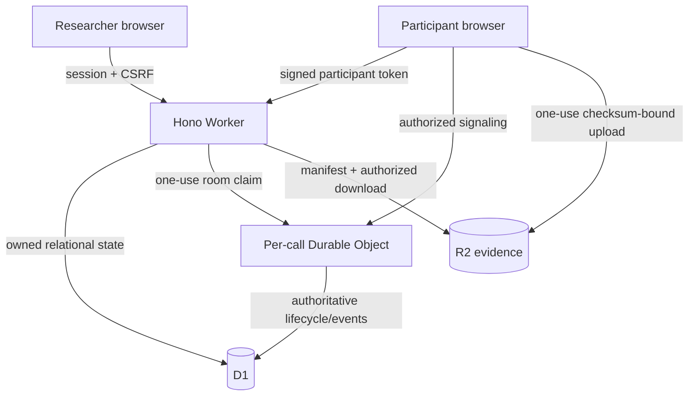

# ACE Omni architectural audit

## Material inspected

The resurrection started from fresh clones of both repositories. The target was inspected at `eb2d06b` (with the unmerged documentation branch at `adc9819`); the upstream reference was inspected at its available snapshot and full reachable history. The audit covered every tracked target file, both Git histories, D1 schema, Worker configuration, UI routes, package manifests, reference MongoDB models, Socket.IO/WebRTC paths, caption configuration, recordings, manipulation configuration, notices, and licenses. `git fsck` and a tracked-source NUL scan were clean in both fresh clones.

The scaffold baseline had 34 tracked files and no lockfile, automated tests, or CI. `npm ci` therefore failed before implementation, which established the first reproducibility acceptance criterion.

## Baseline findings and resolution

| Baseline finding | Security/research impact | Resolution |
|---|---|---|
| WebSocket accepted a literal `participant` token | Anyone could enter a room | HMAC-signed 60-second one-use credentials, D1 consumption, and a second verification inside the Durable Object |
| Participant supplied ID/name/role | Identity and role spoofing | Invitation claims and pinned configuration assign all three server-side; client identity fields are rejected |
| Evidence PUT was unauthenticated | Arbitrary R2 writes and cross-call contamination | Participant-bound one-use upload authorization, server object keys, exact content type/size/SHA-256, and R2 checksum enforcement |
| Ownership checks were absent | Cross-researcher experiment/call/evidence access | Every researcher read/write joins through owner checks; administrators retain explicit global access |
| CSRF token was issued but unused | Credentialed cross-site mutation | SameSite cookies, exact-origin policy, Fetch Metadata rejection, and required matching CSRF cookie/header hashes |
| Credentialed CORS reflected permissively | Cross-origin session abuse | Exact allowlist only; no wildcard path; disallowed origins receive no CORS header |
| Invitation redemption was non-atomic | Replay/race could create multiple identities | D1 transactional batch with conditional single update and uniqueness constraints |
| Schedule was hardcoded | Run could diverge silently from saved research conditions | Pure deterministic expansion from the pinned experiment version and runtime participant mapping |
| Call lifecycle lived only in memory | No auditable recovery | D1 lifecycle/event log plus Durable Object SQLite authority and idempotent event synchronization |
| Durable Object used ephemeral maps | Hibernation lost presence/state | SQLite metadata/participants/events, WebSocket attachments, and `getWebSockets()` recovery |
| Demo credentials were embedded in UI | Credentials could reach a production bundle | Empty login fields; explicit local-only seed script that refuses remote/production use |
| Original reference used unauthenticated Socket.IO room joins and filesystem recordings | Not suitable as a security implementation | Purpose/config semantics retained; security and evidence transport redesigned for Workers/D1/R2 |

## Resulting trust boundaries

The browser is never authoritative for researcher identity, participant identity, role, call membership, experiment configuration, schedule signature, event sequence, R2 key, or evidence metadata. WebRTC media remains peer-to-peer; only sanitized signaling metadata and research events are persisted.

## Reproducibility decisions

- Exact dependency versions and `package-lock.json` are committed.
- Node support is pinned through `.nvmrc` and `engines`.
- Migrations are ordered, rerunnable through Wrangler, and exercised from empty state.
- Seed data is synthetic, idempotent, isolated, and local-only.
- CI checks tracked files for NUL corruption before installation.
- Worker binding types are generated by Wrangler and checked for drift.
- Playwright uses two independent contexts and fake devices; no participant data or external ASR credential is used.
