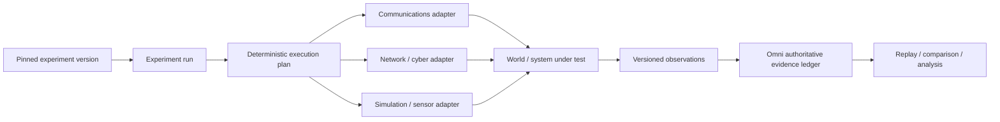

# Emulytics control plane

ACE Omni is not a simulator. It is the experiment-control and evidence plane above one or more systems under test.

The Emulytics extension keeps the existing telecommunications research path intact while introducing a generic protocol that can later drive network emulators, cyber ranges, physical or virtual sensors, simulation engines, communications systems, and human-in-the-loop environments.

## Architectural boundary

**World creation belongs to the attached systems. Experiment authority belongs to Omni.**

That means a future minimega, SCEPTRE, Firewheel, Unreal, hardware-in-the-loop, or other integration should implement the same adapter contract instead of introducing a parallel experiment model.

## Experiment run

`ExperimentRun` is the protocol-level identity of one execution of a pinned experiment version. It records:

- a stable run ID;
- the immutable experiment and experiment-version IDs;
- the pinned configuration version;
- the run seed;
- the issue timestamp; and
- the exact set of declared adapters and their capabilities.

Generic `ExperimentRun` persistence is still separate from the existing `Call` schema. A call remains the durable telecommunications execution primitive. The protocol can now ingest externally produced observation candidates into an Omni-owned generic run without falsely representing that source run as a call.

## Adapter protocol

Every `SystemUnderTestAdapter` exposes the same lifecycle:

1. `prepare(run)` — bind resources to the declared run.
2. `start(plan)` — accept the normalized, pinned execution plan.
3. `command(command)` — apply one versioned command addressed to this adapter.
4. `observe()` — emit versioned evidence-bearing observations.
5. `stop(reason)` — release or quiesce the attached system.

Adapters declare capabilities such as `communications`, `network`, `sensor`, `cyber`, `simulation`, `human`, `storage`, or `custom`. The compiler rejects a command when its target adapter did not declare the required capability.

## Deterministic execution plan

`compileExecutionPlan()` raises the existing experiment-engine abstraction one level without replacing `expandExperimentSchedule()`.

The generic compiler:

- normalizes adapter and capability ordering;
- validates stable run, adapter, operation, and command IDs;
- validates command-to-adapter capability compatibility;
- derives deterministic per-command seeds when a command does not pin one explicitly;
- copies JSON command parameters into the compiled plan so later caller mutation cannot change the plan;
- sorts commands by scheduled offset, adapter ID, and command ID; and
- assigns stable one-based command sequence numbers.

The result is canonicalized and can be SHA-256 digested with `digestExecutionPlan()`.

The invariant is:

> The same pinned run, commands, and seed produce the same normalized execution plan and digest independent of input ordering.

The existing TRS path remains available through `expandExperimentSchedule()`. A future integration can translate a call schedule into the generic plan or wrap the call runtime as a `communications` adapter without changing current call semantics.

## Observation envelope and replay

Observation producers submit `ObservationInput` records. Omni creates `ObservationEnvelope` records with:

- stable observation ID;
- run and adapter identity;
- source identity;
- observation timestamp;
- copied canonical JSON payload; and
- canonical SHA-256 payload digest.

The replay key is:

`runId : adapterId : sourceId : observationId`

An exact observation delivered again is idempotent. Reuse of the same replay key with a different observation timestamp or payload digest is a protocol conflict and is rejected. Different sources therefore retain independent observation-ID namespaces, while a transport retry cannot become a second measurement or silently mutate already identified evidence.

The live Durable Object call ledger applies the same principle at the authenticated room boundary, where the server binds `runId` to the call UUID, assigns authoritative event sequence, synchronizes to D1, and retains the observation in the finalized evidence manifest.

## External observation ingestion

`ObservationIngestionLedger` is the first generic import implementation against the Emulytics protocol.

It supports two cases:

1. an observation already carries the declared Omni run and adapter binding; or
2. an external candidate bundle carries a prior source run/adapter binding that must be validated and preserved as provenance before Omni creates the target envelope.

For the second case, Omni does **not** pretend the foreign run identity was an Omni run. The ledger validates the source binding, creates a new envelope bound to the declared Omni target run and adapter, preserves the observation id, source id, timestamp, and payload, computes the canonical payload digest, and assigns a stable one-based sequence.

The ledger can then export the complete ordered run evidence as canonical JSON plus a SHA-256 digest. Exact replay returns the existing sequence; a replay conflict is rejected without rewriting the original entry.

### First real import: Baudot INTEROP-004

The first imported producer is Baudot, using the exact 17-record `BAUDOT-INTEROP-004` candidate bundle emitted by the green Baudot PR #45 CI run rather than a synthetic approximation.

Source provenance is pinned in `packages/experiment-engine/test/fixtures/README.md`. The test proves:

- all 17 Baudot candidates ingest under the declared source binding;
- Omni creates envelopes under its own target run identity;
- payloads survive canonical round-trip unchanged;
- every envelope receives a canonical SHA-256 digest;
- ledger sequence is stable and one-based;
- exact replay is idempotent;
- changed timestamp under the same replay identity is rejected;
- repeated unchanged ledger export produces the same SHA-256; and
- Baudot's control/signaling-only accessibility facts survive the round trip unchanged.

In particular, the imported evidence retains `control:rttReady=true`, `signaling-only:rttReady=false`, and `signaling-only:oldLegPreserved=true`.

Those are **Baudot facts carried by Omni evidence**, not Omni definitions of accessibility semantics. Baudot retains authority for its readiness vocabulary, scenario assertions, claim scope, and terminal interoperability reduction.

This import is protocol-level evidence authority for the declared generic target run. It is not a claim that the source Baudot CI run executed as a live Cloudflare Durable Object room or that these imported entries were persisted to D1. The live TRS room ledger remains the durable call-scoped authority.

See [`OBSERVATION_LEDGER.md`](OBSERVATION_LEDGER.md) for the two ingestion paths and persistence boundary.

## Synthetic loopback adapter

`SyntheticLoopbackAdapter` exists only to prove the adapter lifecycle contract. It declares `simulation` and `custom`, enforces the lifecycle state machine, accepts commands for its own run, and emits a checksum-bearing observation for each command.

It is deliberately not a simulator. It is a test instrument for the protocol that future real adapters must satisfy.

## Current boundary

The Emulytics layer now has one real external observation producer, but this does not yet:

- persist generic `ExperimentRun` objects to D1;
- persist externally imported generic-run ledger entries to D1 or R2;
- claim the Baudot source CI run was an Omni call;
- add minimega, SCEPTRE, Firewheel, Unreal, or other external runtimes;
- replace the existing `Call` database model or call lifecycle;
- alter Durable Object room authority;
- alter WebRTC, captions, recordings, evidence manifests, or pinned call replay;
- promote any Baudot scenario to `proven`; or
- deploy production Cloudflare resources.

## Next integration

The next useful step is durable generic-run persistence or a live communications-adapter execution path that feeds the same observation protocol.

That work should preserve the invariants now demonstrated by the Baudot import:

1. source and target run authority remain explicit;
2. commands are bound to the pinned run and addressed adapter;
3. observations survive retry without duplication;
4. conflicting observation identity is rejected without rewriting history;
5. the authoritative ledger can export and replay the complete ordered run history; and
6. accessibility or protocol semantics remain owned by the producer's declared contract rather than inferred by the evidence transport.
