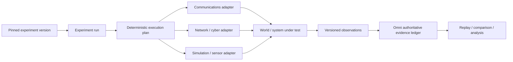

# Emulytics control plane

ACE Omni is not a simulator. It is the experiment-control and evidence plane above one or more systems under test.

The Emulytics extension keeps the existing telecommunications research path intact while introducing a generic protocol that can later drive network emulators, cyber ranges, physical or virtual sensors, simulation engines, communications systems, and human-in-the-loop environments.

## Architectural boundary

**World creation belongs to the attached systems. Experiment authority belongs to Omni.**

That means a future minimega, SCEPTRE, Firewheel, Unreal, hardware-in-the-loop, or other integration should implement the same adapter contract instead of introducing a parallel experiment model.

## Experiment run

`ExperimentRun` is the protocol-level identity of one execution of a pinned experiment version. It records:

- a stable run ID;
- the immutable experiment and experiment-version IDs;
- the pinned configuration version;
- the run seed;
- the issue timestamp; and
- the exact set of declared adapters and their capabilities.

This PR intentionally does not add run persistence or change the existing `Call` schema. A call remains the working telecommunications execution primitive. A later migration can persist generic runs after the protocol has proved stable.

## Adapter protocol

Every `SystemUnderTestAdapter` exposes the same lifecycle:

1. `prepare(run)` — bind resources to the declared run.
2. `start(plan)` — accept the normalized, pinned execution plan.
3. `command(command)` — apply one versioned command addressed to this adapter.
4. `observe()` — emit versioned evidence-bearing observations.
5. `stop(reason)` — release or quiesce the attached system.

Adapters declare capabilities such as `communications`, `network`, `sensor`, `cyber`, `simulation`, `human`, `storage`, or `custom`. The compiler rejects a command when its target adapter did not declare the required capability.

## Deterministic execution plan

`compileExecutionPlan()` raises the existing experiment-engine abstraction one level without replacing `expandExperimentSchedule()`.

The generic compiler:

- normalizes adapter and capability ordering;
- validates stable run, adapter, operation, and command IDs;
- validates command-to-adapter capability compatibility;
- derives deterministic per-command seeds when a command does not pin one explicitly;
- copies JSON command parameters into the compiled plan so later caller mutation cannot change the plan;
- sorts commands by scheduled offset, adapter ID, and command ID; and
- assigns stable one-based command sequence numbers.

The result is canonicalized and can be SHA-256 digested with `digestExecutionPlan()`.

The invariant is:

> The same pinned run, commands, and seed produce the same normalized execution plan and digest independent of input ordering.

The existing TRS path remains available through `expandExperimentSchedule()`. A later PR can translate a call schedule into the generic plan or wrap the call runtime as a `communications` adapter without changing current call semantics.

## Observation envelope and replay

Adapters emit `ObservationEnvelope` records with:

- stable observation ID;
- run and adapter identity;
- source identity;
- observation timestamp;
- copied JSON payload; and
- canonical SHA-256 payload digest.

The replay key is:

`runId : adapterId : sourceId : observationId`

An exact observation delivered again is idempotent. Reuse of the same replay key with a different observation timestamp or payload digest is a protocol conflict and is rejected. Different sources therefore retain independent observation-ID namespaces, while a transport retry cannot become a second measurement or silently mutate already identified evidence.

The current Durable Object research-event deduplication remains unchanged. Future generic-run persistence should carry the same replay-key invariant into the authoritative SQLite sequencer.

## Synthetic loopback adapter

`SyntheticLoopbackAdapter` exists only to prove the contract. It declares `simulation` and `custom`, enforces the lifecycle state machine, accepts commands for its own run, and emits a checksum-bearing observation for each command.

It is deliberately not a simulator. It is a test instrument for the protocol that future real adapters must satisfy.

## What this PR does not do

This is a protocol seam, not an integration PR. It intentionally does not:

- add minimega, SCEPTRE, Firewheel, Unreal, or other external runtimes;
- change the `Call` database model or call lifecycle;
- add D1 migrations;
- alter Durable Object room authority;
- alter WebRTC, captions, recordings, evidence manifests, or replay;
- deploy production Cloudflare resources; or
- touch SF26.

## Next integration

The next PR should implement exactly one real adapter against this protocol. The best first target is one with a narrow command/observation surface and deterministic local validation. That integration should prove:

1. preparation and teardown are idempotent;
2. commands are bound to the pinned run and addressed adapter;
3. adapter observations survive retry without duplication;
4. conflicting observation identity is rejected;
5. the authoritative Omni ledger can replay the complete run history; and
6. a baseline-versus-intervention pair can be compared from immutable evidence.
